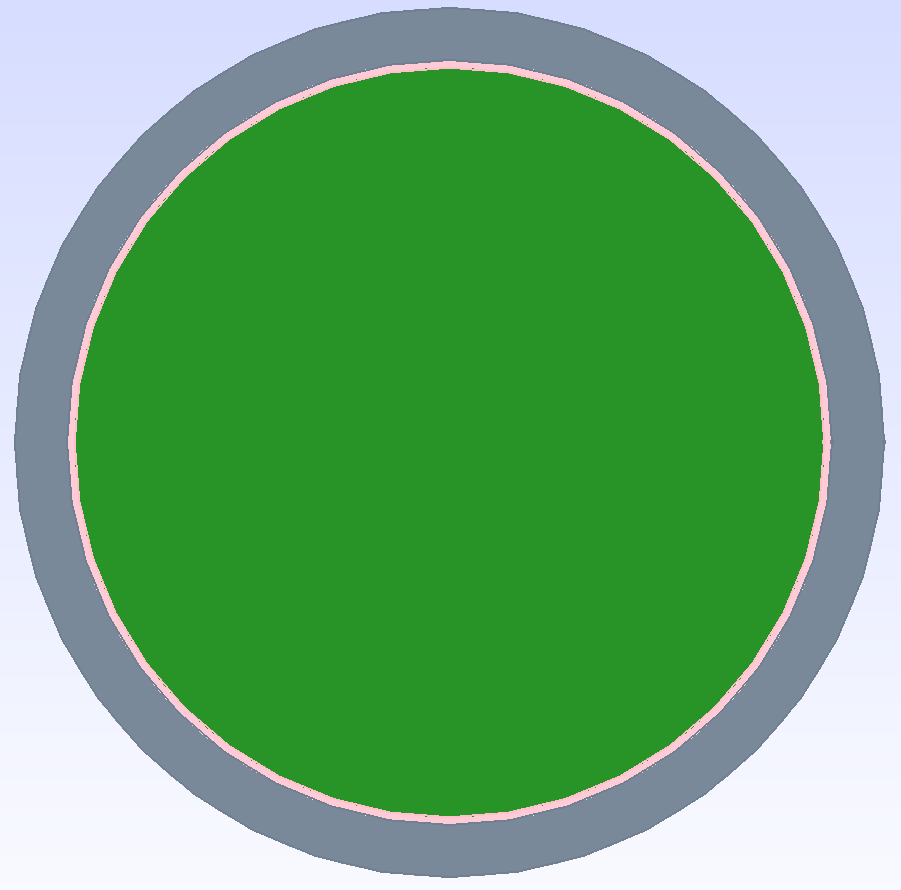
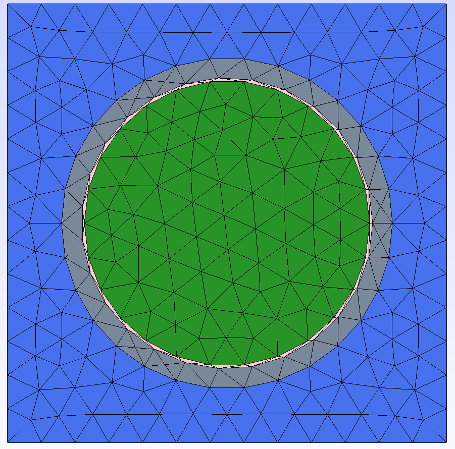

.. _tutorial_2d:

=======================================
Two-dimensional Modeling and Meshing
=======================================

This tutorial will demonstrate how to create and mesh 2D CAD geometries of increasing complexity.
The models we will create are:

  1. `VERA benchmark problem 1A <https://corephysics.com/docs/CASL-U-2012-0131-004.pdf>`_
  
  2. `VERA benchmark problem 2A <https://corephysics.com/docs/CASL-U-2012-0131-004.pdf>`_
  
  3. `C5G7 2D <https://doi.org/10.1016/j.pnueene.2004.09.003>`_

  4. `A 2D CROCUS <https://doi.org/10.1016/j.anucene.2005.09.012>`_ model

.. _tutorial_2d_1a:

VERA Problem 1A
===============

First, we create the CAD model for the VERA problem 1A. This is a simple 2D model of a fuel pin.

.. literalinclude:: ../../../tutorial/2d/1a_model.cpp
    :language: cpp

If the FLTK line is commented out and visibility options changed as indicated, the model should
look like this:

Then, we create the mesh for the model.

.. literalinclude:: ../../../tutorial/2d/1a_mesh.cpp
    :language: cpp

The mesh should look like this:

.. note::

    `ParaView <https://www.paraview.org/>`_ is a useful tool for visualizing XDMF files of the final
    mesh.

.. _tutorial_2d_2a:

VERA Problem 2A
===============

Coming soon!

.. _tutorial_2d_c5g7:

C5G7 2D
=======

Coming soon!

.. _tutorial_2d_crocus:

CROCUS 2D
=========

Coming soon!
