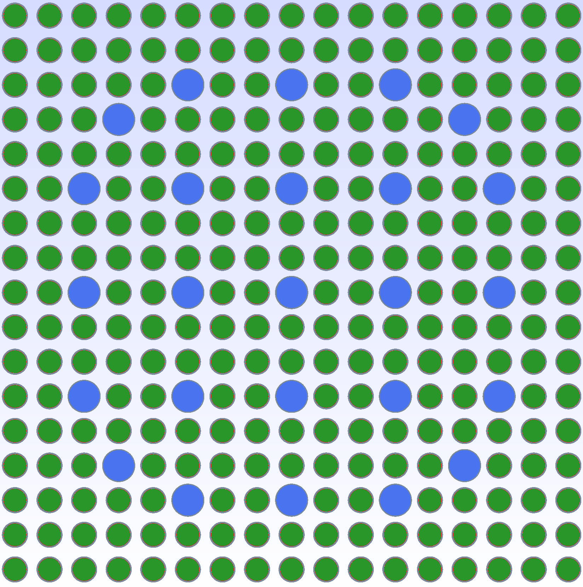
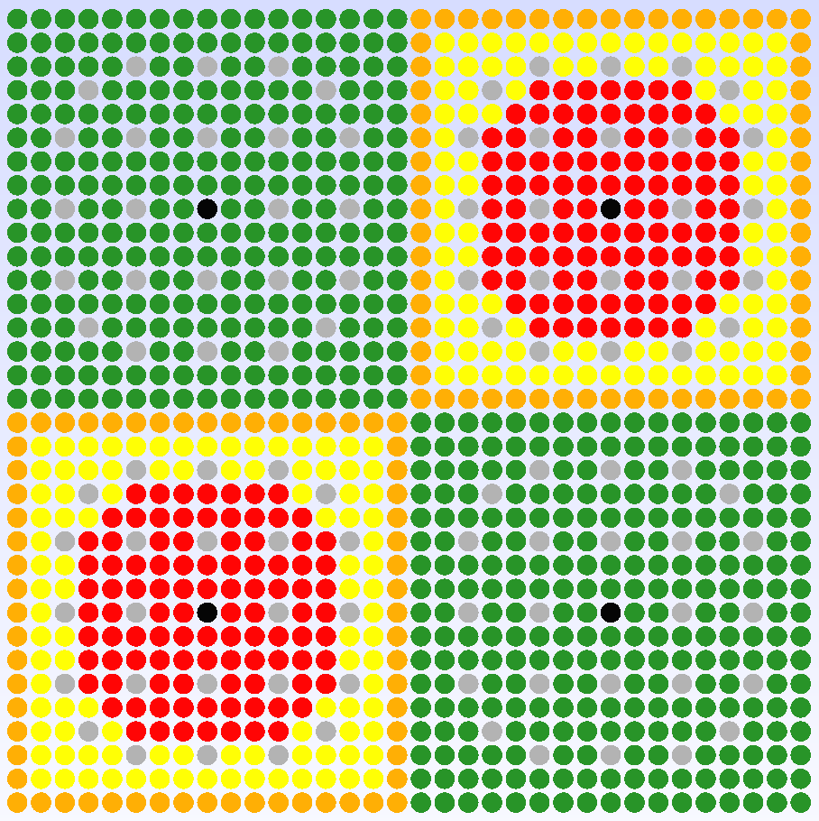
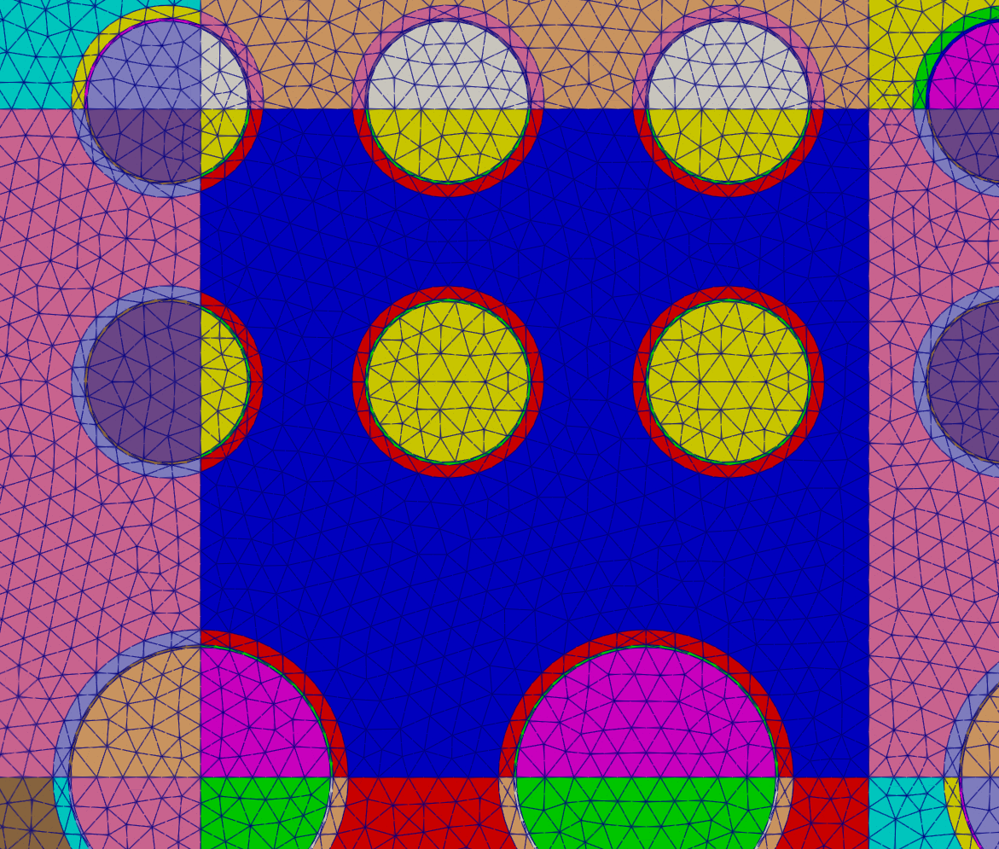

.. _tutorial_2d:

=======================================
Two-dimensional Modeling and Meshing
=======================================

This tutorial will demonstrate how to create and mesh 2D CAD geometries of increasing complexity.
The models we will create are:

  1. `VERA benchmark <https://corephysics.com/docs/CASL-U-2012-0131-004.pdf>`_ problem 1A 
  
  2. `VERA benchmark <https://corephysics.com/docs/CASL-U-2012-0131-004.pdf>`_ problem 2A, without inter-assembly gap 

  3. `VERA benchmark <https://corephysics.com/docs/CASL-U-2012-0131-004.pdf>`_ problem 2A 
  
  4. `C5G7 <https://doi.org/10.1016/j.pnueene.2004.09.003>`_ 2D 

  5. A 2D `CROCUS <https://doi.org/10.1016/j.anucene.2005.09.012>`_ model

.. _tutorial_2d_1a:

VERA Problem 1A
===============

First, we create the CAD model for VERA problem 1A. This is a simple 2D model of a fuel pin.
The goal of this model is to demonstrate the basic workflow of creating a model and meshing it, 
along with the anatomy of an MPACT model.

.. literalinclude:: ../../../tutorial/2d/1a_model.cpp
    :language: cpp

If the FLTK line is commented out and visibility options changed as indicated, the model should
look like this:

.. image:: ../_images/1a_model.png
    :width: 300px
    :align: center

Then, we create the mesh for the model.

.. literalinclude:: ../../../tutorial/2d/1a_mesh.cpp
    :language: cpp

The mesh should look like this:

.. image:: ../_images/1a_mesh.png
    :width: 400px
    :align: center

.. note::

    `ParaView <https://www.paraview.org/>`_ is a useful tool for visualizing XDMF files of the 
    final mesh. You can use the following command to visualize the file.
    
    .. code-block:: bash
        
        paraview 1a.xdmf
 

    In Paraview, you will be recieve a prompt "Open data with...". Select the 
    "XDMF Reader" option and hit okay. 
    After opening, hit the Apply button which should appear on the left hand side. 
    Next, at the top select the drop down menu which has "vtkBlockColors" and swicth this 
    field to "Materials". Finally, at the top, select the drop down menu which has "Surface" 
    and switch this field to "Surface with Edges".
    You should now be able to visualize the generated mesh by material in each region.

.. _tutorial_2d_2a_nogap:

VERA Problem 2A (No Gap)
========================

Next we will create a CAD model for VERA problem 2A without the inter-assembly 
gap. This is a 2D model of a fuel assembly. The goal of this model is to demonstrate
how to create and take advantage of repeating geometries.

.. literalinclude:: ../../../tutorial/2d/2a_nogap_model.cpp
    :language: cpp

If the FLTK line is commented out and visibility options changed as indicated, the model 
should look like this:

Then, we create the mesh for the model.

.. literalinclude:: ../../../tutorial/2d/2a_nogap_mesh.cpp
    :language: cpp

.. _tutorial_2d_2a:

VERA Problem 2A
===============

This is the same model as above, but with the inter-assembly gap. The goal of this model is to
show how to deal with a slightly more complex model, while still capitalizing on the repeating
geometry.

.. literalinclude:: ../../../tutorial/2d/2a.cpp
    :language: cpp

.. _tutorial_2d_c5g7:

C5G7 2D
=======

This is a 2D model of the C5G7 benchmark problem. The goal of this model is to better demonstrate
how to map increasingly complex geometries to the MPACT spatial partitioning scheme.

.. literalinclude:: ../../../tutorial/2d/c5g7_2d.cpp
    :language: cpp

The CAD geometry for this model is shown below:

.. _tutorial_2d_crocus:

CROCUS 2D
=========

This is a 2D model of the CROCUS reactor. This is a reactor that cannot be easily placed into
the MPACT spatial partitioning scheme due to the different pin sizes and pitches of the inner
and outer core. The goal of this model is to demonstrate how to handle arbitrary geometries.

.. literalinclude:: ../../../tutorial/2d/crocus_2d.cpp
    :language: cpp

We can visualize the mesh in Paraview, coloring by block, to see how the grid overlay has
cut the geometry. This grid overlay and handling of arbitrary CAD geometries is a unique
feature of the meshing capabilities of UM2.

